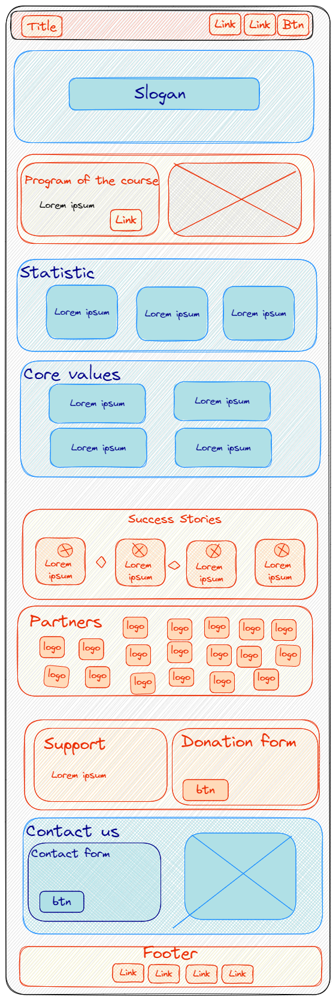
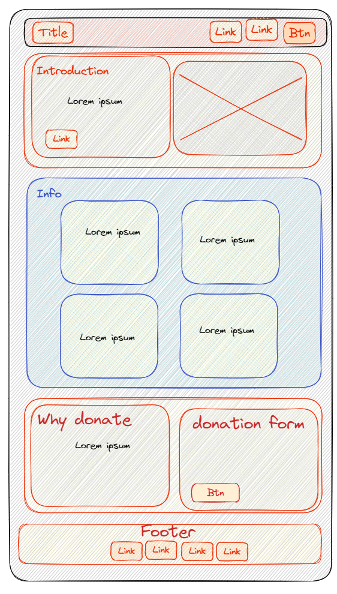

# Design

## Project's design overview

> Below are the wireframes of the website. The wireframes are created for 3
> pages.

- Home page
- The program page
- Support us page

---

> - Red elements - must-have
> - Blue elements - should-have
> - Yellow elements - could-have

<!-- give an overview of your project's design -->
<!-- describe the reasoning behind your group's design and wireframe -->
<!-- include other centralized decisions like fonts, palates, ... -->

---

## Wireframe(s)

- HOME

- THE PROGRAM

- SUPPORT US

<!-- provide a link to your wireframe documenting on Figma, or wherever it is -->
